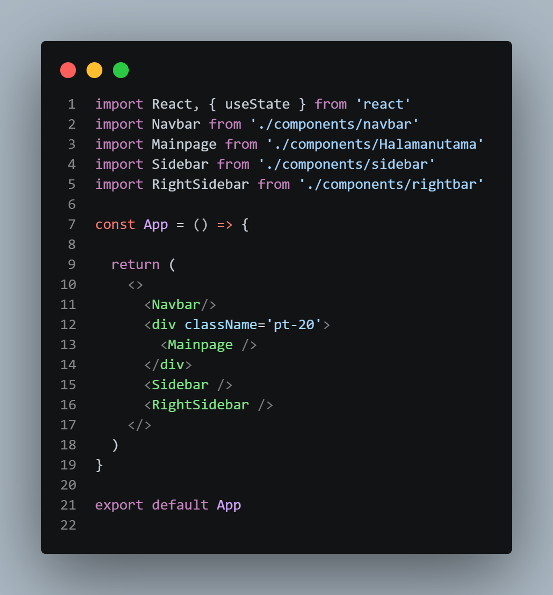
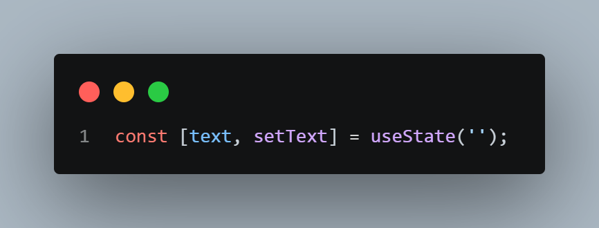
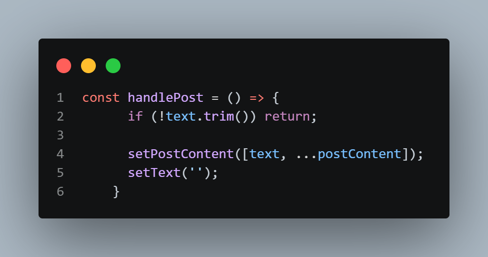
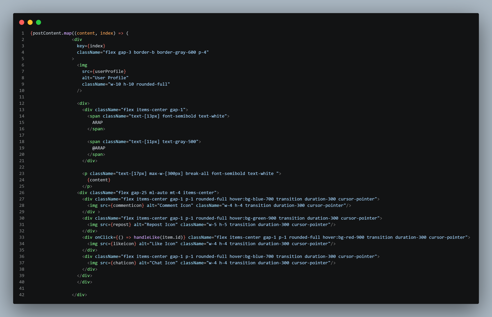
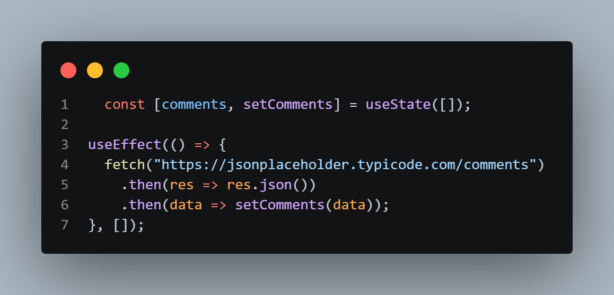
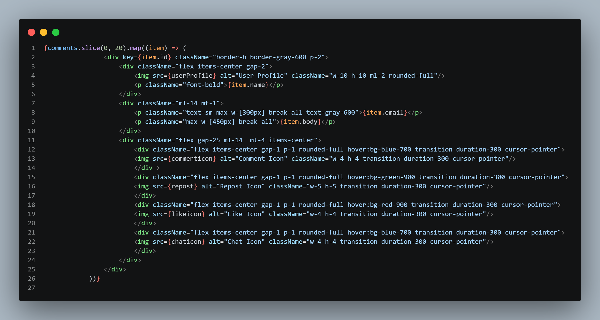

<<<<<<< HEAD

# CLONING WEB X/TWITTER

DESKRIPSI
===================================================================================================================================

Di project ini saya mengcloning web x/twitter sederhana yang dibuat menggunakan react dan tailwind CSS, menggunakan api dan usetate

FITUR
===================================================================================================================================

-user bisa memposting

-user bisa melihat daftar posting yang di ambil dari api

-navigation bar

-sidebar

-rightbar 

-trending view

TECH STACK
===================================================================================================================================

-ReactJS

-Tailwind CSS

-React Hooks (useState, useEffect)

PROJECT STRUCTURE
===================================================================================================================================

pada project ini, struktur dibagi menjadi beberapa bagian utama seperti

components untuk komponen UI yang bisa digunakan ulang seperti:

sidebar
======================================================
Fungsi:

Menu samping (kiri)
seperti:

-Home

-Profile

-chat

rightbar
======================================================
Fungsi:

Sidebar kanan
berisi:

-Trending

-today news

navbar
======================================================
Fungsi:

Navigasi atas (for you dan following)
Biasanya ada icon + menu

halaman utaman/mainpage
======================================================
Fungsi:

-main content / feed

-Tempat post muncul

sidebar.css
======================================================
Fungsi:

-Styling khusus sidebar

-Dipisah karena lebih kompleks

CODE EXPLANATION
======================================================

## Code Explanation (App.jsx)

### Import React & Components
-Mengimpor React dan semua komponen yang digunakan seperti Navbar, Mainpage, Sidebar, dan RightSidebar.

### Navbar Component
-Menampilkan navigasi di bagian atas.

### Main Content (Mainpage)
-Menampilkan konten utama aplikasi.
Wrapper (div pt-20)
Memberikan jarak atas agar konten tidak tertutup Navbar.

### Sidebar Component
-Menampilkan navigasi di sisi kiri.

### RightSidebar Component
-Menampilkan konten tambahan di sisi kanan.

CODE EXPLANATION MAINPAGE USETATE
==================================================================

Di bagian ini saya membuat fitur sederhana seperti Twitter/X, di mana user bisa membuat post dan langsung muncul di feed.

### Handle Post

Fungsi handlePost saya gunakan untuk menangani saat user membuat post:

Saya cek dulu apakah input kosong, kalau kosong maka tidak diproses
Jika ada isi, text akan dimasukkan ke state postContent
Post baru saya letakkan di paling depan agar muncul paling atas
Setelah itu input saya reset menjadi kosong

Intinya: fungsi ini digunakan untuk menambahkan post baru.

### render Post

Untuk menampilkan post, saya menggunakan postContent.map():

Semua data post saya looping
Setiap item ditampilkan menjadi sebuah card

Isi dari card:

-Foto profil user

-Nama dan username

-Isi post

-Beberapa icon seperti comment, repost, like, dan share

Intinya: bagian ini digunakan untuk menampilkan semua post ke tampilan.

CODE EXPLANATION MAINPAGE API
====================================================================

# Fetch Data API dengan React

## Mengambil Data dari API

Data komentar diambil ketika component pertama kali dirender. Setelah data diterima dari API, data tersebut disimpan ke dalam state sehingga dapat digunakan oleh component.

---

## Menampilkan Data

Data yang sudah tersimpan kemudian dibatasi menjadi 20 komentar pertama. Selanjutnya dilakukan perulangan pada setiap data untuk ditampilkan ke halaman.

---

## Menampilkan Informasi

Setiap komentar menampilkan beberapa informasi, yaitu nama pengguna, email pengguna, dan isi komentar.

---

## Kesimpulan

Program mengambil data dari API, menyimpannya ke state, lalu melakukan perulangan untuk menampilkan 20 komentar pertama ke halaman.
>>>>>>> cccab9d21fea63276269aaa883abae2dd58703ce
