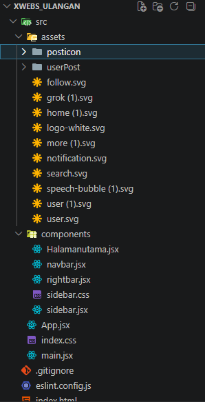

<<<<<<< HEAD

# CLONING WEB X/TWITTER

DESKRIPSI
===================================================================================================================================

Di project ini saya mengcloning web x/twitter sederhana yang dibuat menggunakan react dan tailwind CSS, menggunakan api dan usetate

FITUR
===================================================================================================================================

-user bisa memposting

-user bisa melihat daftar posting yang di ambil dari api

-navigation bar

-sidebar

-rightbar 

-trending view

TECH STACK
===================================================================================================================================

-ReactJS

-Tailwind CSS

-React Hooks (useState, useEffect)

PROJECT STRUCTURE
===================================================================================================================================

>>>>>>> cccab9d21fea63276269aaa883abae2dd58703ce
